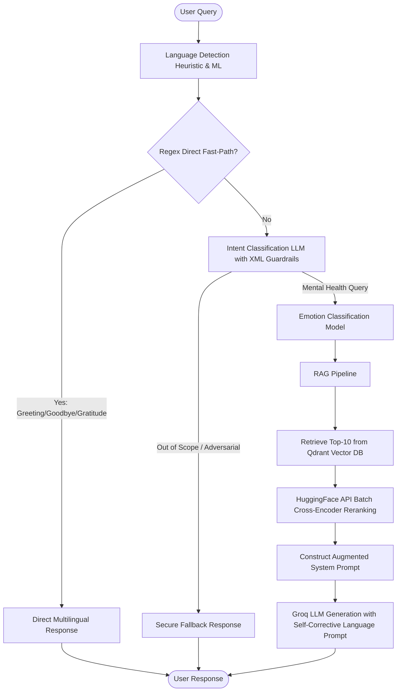

# 🧠 Mental Health RAG Chatbot

[](https://python.org)
[](https://fastapi.tiangolo.com)
[](https://qdrant.tech)
[](https://huggingface.co)
[](https://groq.com)

An advanced, production-ready, production-grade **Mental Health Retrieval-Augmented Generation (RAG) Chatbot** designed to provide empathetic, localized, and highly secure counseling support. The system integrates real-time language detection, emotion classification, adversarial guardrails, and hybrid retrieval with cross-encoder reranking to deliver high-quality responses in multiple languages.

---

## 🏗️ Architecture Flow



---

## ✨ Core Features

*   **⚡ Two-Layer Conversational Router**:
    *   *Layer 1 (Regex Fast Path)*: Instantly routes common greetings, gratitude, and goodbyes in English, Arabic, French, Spanish, German, and Italian (0ms latency).
    *   *Layer 2 (LLM Classifier)*: Employs a robust intent classifier wrapped in XML-tagged prompt guidelines to detect complex conversational flows and safeguard against adversarial prompt injections.
*   **🛡️ Strong Guardrails & Security**:
    *   Pre-empts adversarial attacks (e.g., distraction/coping framing patterns) and filters out of-scope queries securely.
*   **🎭 Emotion-Aware Responses**:
    *   Detects emotional state (Fear, Anger, Sadness, Joy, etc.) from the query using a dedicated adapter-tuned classifier to help contextualize the conversation.
*   **🔍 Hybrid Retrieval & Batch Reranking**:
    *   Retrieves the top `k=10` relevant mental health articles/contexts from a **Qdrant Vector Database**.
    *   Applies a HuggingFace-based **Cross-Encoder Reranker** via batch requests to rank retrieved documents, optimizing relevance scores and mitigating hallucinations.
*   **🌐 Self-Correcting Multilingual Engine**:
    *   Robust language detection with custom heuristics to support short/informal English queries and prevent misclassification.
    *   Augmented system prompt instructs the generator LLM to match the user's input language, preventing cross-language output bleed.
*   **📈 Integrated Evaluation Suite**:
    *   Fully integrated with **DeepEval** and **Ragas** to assess answer faithfulness, relevancy, and context recall.

---

## 📂 Project Structure

```bash
Mental-Health-RAG-Chatbot/
├── .env.example              # Environment variables template
├── .gitignore                # Production git rules
├── README.md                 # Project README
├── main.py                   # Server startup
├── pyproject.toml            # Project configurations and dependency declarations
├── uv.lock                   # Project lockfile (managed by uv)
├── team_members.txt          # Team members
├── src/                      # Source code directory
│   ├── app.py                # FastAPI web server and request handlers
│   ├── router.py             # Dual-layer conversational router (Regex + LLM)
│   ├── modules.py            # Intent, Emotion, and Language Classifier modules
│   ├── rag_pipeline.py       # Qdrant retrieval, HF reranker, and generator prompt assembly
│   ├── run_evaluation.py     # Evaluation runner entrypoint
│   ├── evaluator_deepeval.py # DeepEval framework implementation
│   ├── evaluator_ragas.py    # RAGAS framework implementation
│   ├── static/               # CSS styles for Frontend UI
│   └── templates/            # HTML templates for Frontend UI
├── notebooks/                # Model exploration and prototyping notebooks
│   ├── Emotion_Classification.ipynb
│   ├── Intent_classification.ipynb
│   ├── Language_Detection.ipynb
│   └── RAG.ipynb
└── artifacts/                # Trained model weights & serialized assets
    ├── emotion_classifier/   # Fine-tuned adapter model configs and weights
    └── language_detection_best_model.pkl
```

---

## 🛠️ Environment Variables Setup

Create a `.env` file in the root directory and configure the following variables:

```env
# Groq LLM Settings
GROQ_API_KEY=your_groq_api_key_here

# HuggingFace Settings
HF_TOKEN=your_huggingface_token_here

# Local Ollama Settings (Optional / Alternate)
OLLAMA_HOST=http://localhost:11434
OLLAMA_MODEL=llama3.2:latest
OLLAMA_TIMEOUT_SECONDS=30

# Advanced RAG Configurations
ENABLE_TRANSLATION=False
DOMAIN_SIMILARITY_THRESHOLD=0.35
```

---

## 🚀 Getting Started

We recommend using [uv](https://github.com/astral-sh/uv) to manage project dependencies and virtual environments.

### 1. Install Dependencies
```powershell
uv pip install -e .
```

### 2. Run the FastAPI Application
Start the FastAPI server:
```powershell
uv run uvicorn src.app:app --reload --host 0.0.0.0 --port 8000
```
Open [http://localhost:8000](http://localhost:8000) in your browser to interact with the web interface.

### 3. Run Unit Tests
Verify routing, pipeline configurations, and classifier modules:
```powershell
uv run pytest
```

### 4. Run RAG Evaluation
To evaluate RAG performance metrics (Faithfulness, Relevancy, Recall) using Ragas or DeepEval:
```powershell
uv run python src/run_evaluation.py
```

---

## 👥 Team Members

This project was built and is maintained by:

1.  **Ahmed Ashraf Abdulwahab Saleem**
2.  **Mazen Mohamed Montaset Elsay**
3.  **Peter Hany Fayez**
