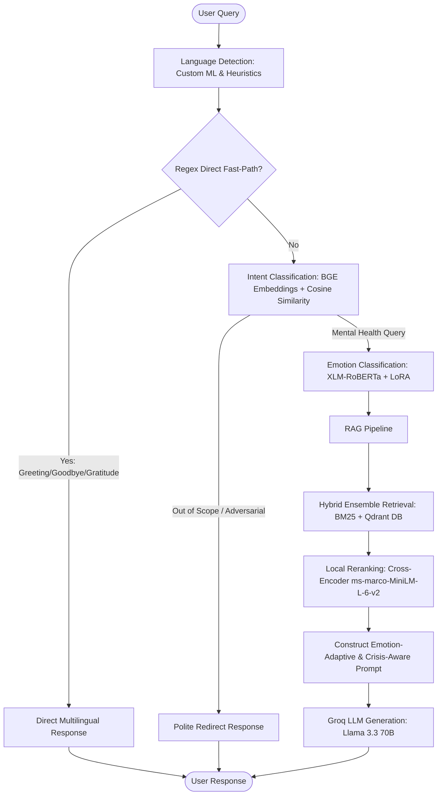

# 🧠 Mental Health RAG Chatbot

<p align="center">
  
  
  
  
  
</p>

<p align="center">
  
  
  
  
</p>

---

## 🌟 Overview

An advanced, production-grade **Mental Health Retrieval-Augmented Generation (RAG) Chatbot** designed to provide empathetic, localized, and highly secure counseling support. The system integrates real-time language detection, emotion classification, adversarial guardrails, and hybrid retrieval with local cross-encoder reranking to deliver high-quality responses in multiple languages.

---

## 🏗️ Architecture & Pipeline Flow

The chatbot employs a multi-layered classification, routing, and retrieval pipeline to process messages with safety and empathy:



---

## ✨ Core Features

*   **⚡ Two-Layer Conversational Router**:
    *   *Layer 1 (Regex Fast Path)*: Instantly routes common greetings, gratitude, and goodbyes in English, Arabic, French, Spanish, German, and Italian (0ms latency).
    *   *Layer 2 (Embedding Classifier)*: Classifies messages into `general`, `out_of_scope`, or `asking_mental_health_question` using `BAAI/bge-small-en-v1.5` embeddings compared against query examples with a threshold of 0.65, falling back to local `Ollama` / LLM fallback when necessary.
*   **🛡️ Strong Guardrails & Security**:
    *   Pre-empts adversarial attacks (e.g., distraction/coping framing patterns) and filters out of-scope queries securely.
*   **🎭 Emotion-Aware Responses**:
    *   Detects emotional state (Fear, Anger, Sadness, Joy, Love, Surprise) from the query using a dedicated adapter-tuned **XLM-RoBERTa** classifier. If top confidence is under 0.70, it returns the top two emotions to contextually adapt response tones.
*   **🔍 Hybrid Retrieval & Local Reranking**:
    *   Retrieves the top `k=10` relevant mental health articles/contexts from an ensemble combining a **BM25 Retriever** (weight 0.45) and a **Qdrant Vector Database** (weight 0.55).
    *   Applies a local **Cross-Encoder Reranker** (`cross-encoder/ms-marco-MiniLM-L-6-v2`) to select the top 3 most relevant articles.
*   **🌐 Self-Correcting Multilingual Engine**:
    *   Robust language detection using TF-IDF + Logistic Regression with custom heuristics to support short/informal English queries and prevent misclassification.
    *   Augmented system prompt instructs the generator LLM to match the user's input language, preventing cross-language output bleed.
*   **📈 Integrated Evaluation Suite**:
    *   Fully integrated with **DeepEval** and **Ragas** to assess answer faithfulness, relevancy, and context recall.

---

## 📂 Project Structure

```bash
Mental-Health-RAG-Chatbot/
├── .env.example                      # Environment variables template
├── .gitignore                        # Git exclusion rules
├── pyproject.toml                    # Poetry/PEP 518 project dependencies and tool configs
├── uv.lock                           # Lockfile for reproducible environment state
├── main.py                           # Server startup entry point
├── team_members.txt                  # Contributors list
├── README.md                         # Project documentation
│
├── src/                              # Source code directory
│   ├── __init__.py                   # Package initialization
│   ├── app.py                        # FastAPI web server and endpoints configuration
│   ├── router.py                     # Dual-layer query routing logic (Regex + Embeddings)
│   │
│   ├── modules/                      # Modularised machine learning & NLP inference engines
│   │   ├── __init__.py               # Convenience wrappers and singleton pipeline interfaces
│   │   ├── language_detector.py      # TF-IDF + Logistic Regression language classifier
│   │   ├── intent_classifier.py      # BGE embedding similarity and LLM/Ollama fallback
│   │   ├── emotion_classifier.py     # Custom fine-tuned XLM-RoBERTa + PEFT/LoRA adapter
│   │   └── rag.py                    # BM25 + Qdrant hybrid retrieval and Cross-Encoder reranking
│   │
│   ├── static/                       # Frontend assets
│   │   └── style.css                 # Main application styling sheets
│   │
│   └── templates/                    # Web templates
│       └── index.html                # Interactive chatbot dashboard UI
│
├── tests/                            # Validation and testing suite
│   ├── __init__.py                   # Test module setup
│   ├── test_language_detector.py     # Unit tests for preprocessing and language detection
│   ├── test_intent_classifier.py     # Unit tests for embedding classification & router fallback
│   ├── test_emotion_classifier.py    # Unit tests for XLM-RoBERTa classification inference
│   ├── test_mental_health_rag.py     # Unit tests for document cache loaders and RAG pipeline
│   └── test_router.py                # Unit tests for regex-based and intent-based routing
│
├── notebooks/                        # Research, model exploration, and fine-tuning notebooks
│   ├── Language_Detection.ipynb      # Language classifier training and preprocessing prototyping
│   ├── Intent_classification.ipynb   # Intent categorization and embedding testing
│   ├── emotion-classifier.ipynb      # XLM-RoBERTa fine-tuning with LoRA
│   └── RAG.ipynb                     # Hybrid retrievers, reranking, and generation exploration
│
├── metrics/                          # Model training performance evaluations and visualizations
│   ├── language_detection/           # Confusion matrix for language detector
│   │   └── temp_cm.png
│   ├── intent_classifier/            # Intent classifier validation metrics
│   │   ├── per_class_f1.png
│   │   └── pipeline_results.png
│   └── emotion_classification/       # Emotion adapter training logs and distribution plots
│       ├── confusion_matrix.png
│       ├── eda_distribution.png
│       └── Screenshot 2026-05-27 234434.png
│
└── artifacts/                        # Serialized models and processed dataset cache
    ├── processed_docs.pkl            # Preprocessed and cached LangChain documents list
    ├── langauge_detection/           # Pickle model files for language detection
    │   ├── language_detection_best_model.pkl
    │   └── language_detection_best_vectorizer.pkl
    └── emotion_classifier/           # Fine-tuned XLM-RoBERTa adapter configuration and weights
        ├── README.md
        ├── adapter_config.json
        ├── adapter_model.safetensors
        ├── tokenizer.json
        ├── tokenizer_config.json
        └── training_config.json
```

---

## 🛠️ Environment Variables Setup

Create a `.env` file in the root directory and configure the following variables:

```env
GROQ_API_KEY=YOUR_API_KEY_HERE
HF_TOKEN=YOUR_HF_TOKEN_HERE

# Qdrant Settings (Leave empty to use local database under qdrant_db/)
QDRANT_URL=YOUR_QDRANT_URL_HERE
QDRANT_API_KEY=YOUR_QDRANT_API_KEY_HERE
```

---

## 🚀 Getting Started

We recommend using [uv](https://github.com/astral-sh/uv) to manage project dependencies and virtual environments.

### 1. Install Dependencies
Initialize and sync your local virtual environment:
```powershell
uv sync
```

### 2. Run the FastAPI Application
Start the FastAPI server:
```powershell
uv run main.py
```
Open [http://localhost:8000](http://localhost:8000) in your browser to interact with the web interface.

### 3. Run Unit Tests
Verify routing, pipeline configurations, and classifier modules:
```powershell
uv run pytest
```

---

## 👥 Team Members

This project was built and is maintained by:

1.  **Ahmed Ashraf Abdulwahab Saleem**
2.  **Mazen Mohamed Montaset Elsay**
3.  **Peter Hany Fayez**
