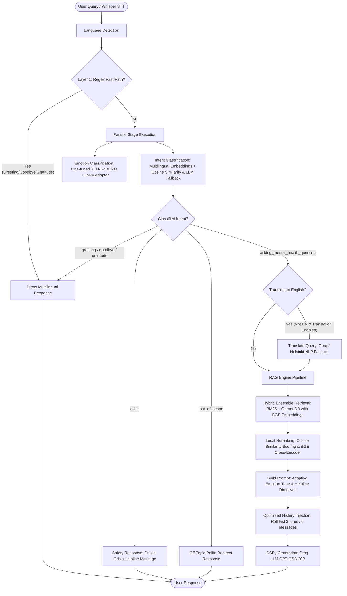

# 🧠 Sanad (سند) — Empathetic Mental Health RAG Chatbot

<p align="center">
  
  
  
  
  
  
</p>

<p align="center">
  
  
  
  
</p>

---

## 🌟 Overview

**Sanad (سند)** is an advanced, production-grade **Mental Health Retrieval-Augmented Generation (RAG) Chatbot** designed to act as an empathetic, secure, and grounded workspace for counseling support. 

The application features secure user workspaces (authentication and persistent chat histories via a local SQLite database), real-time speech-to-text audio streaming with client-side voice silence detection, multilingual routing, emotion tone adaptors, cross-encoder reranking, and a compiled DSPy instruction-tuning harness optimized via the GEPA compiler.

---

## 🏗️ Architecture & Pipeline Flow

The chatbot employs a multi-layered classification, routing, and retrieval pipeline to process messages with safety and empathy, as implemented in [router.py](file:///d:/ITI/ITI%20Courses/18%29%20NLP/Project/New%20folder%20%283%29/src/router.py):



---

## ✨ Core Features

*   **🔐 Secure User Authentication & Chat History Workspace**:
    *   Integrates registration (`/register`) and login (`/login`) views, backed by a FastAPI `SessionMiddleware` session layer and secure PBKDF2 (SHA-256) password hashing.
    *   Manages user-specific conversations in a local SQLite database (`chat_interactions.sqlite3`), permitting users to load (`/chat/history`), persist, or clear (`/chat/clear`) their chat history.
*   **🎙️ Whisper Speech Input & Client-Side Silence Detection**:
    *   Supports hands-free speech input utilizing the browser's native `MediaRecorder` API.
    *   Leverages real-time client-side voice activity and silence analysis to automatically stop recording and upload the voice sample.
    *   Transcribes speech via Groq's high-speed API utilizing the `whisper-large-v3` model over `/transcribe`.
*   **⚙️ Compiled DSPy GEPA Prompt Optimization**:
    *   Employs programmatic prompt engineering via **DSPy** signatures and modules to structure LLM inputs, routing, and context injections.
    *   Optimized using the **GEPA (Generalizable Prompt Optimization)** compiler to bootstrap few-shot instruction weights across 5 core modules:
        *   `RetrievalRouterModule` (routes chat history vs RAG retrieval queries).
        *   `QueryCondenserModule` (formulates history-aware standalone questions in English).
        *   `GroundedResponseModule` (generates clinically-grounded counseling feedback).
        *   `GeneralConversationModule` (handles warm chit-chat greetings or user introductions).
        *   `IntentClassifierModule` (handles fallback LLM intent determination).
    *   Compiled prompt instructions are serialized to `artifacts/dspy optimized prompts/` and loaded automatically at startup.
*   **⚡ Two-Layer Conversational Router**:
    *   *Layer 1 (Regex Fast Path)*: Instantly routes common greetings, gratitude, and goodbyes in English, Arabic, French, Spanish, German, and Italian (0ms latency).
    *   *Layer 2 (Embedding Classifier)*: Classifies messages into `general`, `out_of_scope`, `asking_mental_health_question`, or `crisis` using `sentence-transformers/paraphrase-multilingual-MiniLM-L12-v2` embeddings compared against query examples with a threshold of 0.65, falling back to a Groq LLM completion when necessary.
*   **🛡️ Multi-Tiered Safety & Crisis Safeguards**:
    *   Detects suicidal or self-harm intents via matching crisis lists and embeddings.
    *   Employs a **Crisis Gate**: If an embedding classification detects a crisis with confidence under `0.85`, it escalates to the optimized DSPy LLM classifier for secondary validation to prevent false negatives.
    *   Automatically appends local emergency helplines in the user's language and blocks prompt injection attacks.
*   **🎭 Emotion-Aware Adaptive Tone**:
    *   Detects emotional state (Fear, Anger, Sadness, Joy, Love, Surprise) from the query using a dedicated adapter-tuned **XLM-RoBERTa** classifier. If top confidence is under 0.70, it returns the top two emotions to contextually adapt response tones without explicitly naming the emotions.
*   **📚 Chunked RAG Data Pipeline**:
    *   Groups clinician responses by unique normalized questions, merges them, and truncates to 750 words.
    *   Splits long merged responses into optimized chunks using `RecursiveCharacterTextSplitter` (chunk size = 500, overlap = 100) to find the most relevant portion, preventing context dilution and improving grounding precision.
*   **🔍 Hybrid Retrieval & Interactive Grounding**:
    *   Retrieves the top relevant mental health contexts from an ensemble combining a **BM25 Retriever** (weight 0.45) and a **Qdrant Vector Database** (weight 0.55).
    *   Applies **Cosine Similarity Scoring** locally using query embeddings to precisely filter the top 3 most relevant contexts without relying on external APIs.
    *   Features an **Interactive Citations Modal UI**: Clicking inline citation numbers (e.g. `1`) or Grounded Reference Cards pops up a detailed overlay displaying the clinical advice and counselor case context.
*   **👁️ LangSmith Observability**:
    *   End-to-end tracing integrated across the pipeline (from Router logic to DSPy LLM generation) to monitor latency, track costs, and evaluate output quality in real-time.
*   **💬 Optimized Rolling Conversation History**:
    *   Tracks conversation history on both the client (frontend UI) and server (backend payload).
    *   Prunes history dynamically to keep only the last 3 turns (last 6 messages) to maintain context and continuity while keeping the context window small, fast, and cost-effective.
*   **🌐 Self-Correcting Multilingual Engine**:
    *   Robust language detection to dynamically identify the user's language.
    *   Optional translation pipeline (`Helsinki-NLP/opus-mt-mul-en`) to translate queries before retrieval and enforce responses in the user's native language.
*   **📈 Integrated Evaluation Suite**:
    *   Fully integrated with **DeepEval** and **Ragas** to assess answer faithfulness, relevancy, factual correctness, and context recall.

---

## 📂 Project Structure

```bash
Mental-Health-RAG-Chatbot/
├── .env.example                      # Environment variables template
├── .gitignore                        # Git exclusion rules
├── pyproject.toml                    # Hatchling project dependencies and tool configs
├── uv.lock                           # Lockfile for reproducible environment state
├── main.py                           # Server startup entry point
├── team_members.txt                  # Contributors list
├── README.md                         # Project documentation
│
├── src/                              # Source code directory
│   ├── __init__.py                   # Package initialization
│   ├── app.py                        # FastAPI web server, auth sqlite database, STT and chatbot routes
│   ├── config.py                     # Centralized path and environment settings manager
│   ├── router.py                     # Dual-layer query routing logic (Regex + Embeddings + LLM fallback)
│   │
│   ├── modules/                      # Modularised machine learning & NLP inference engines
│   │   ├── __init__.py               # Convenience wrappers and singleton pipeline interfaces
│   │   ├── language_detector.py      # TF-IDF + Logistic Regression language classifier
│   │   ├── intent_classifier.py      # Multilingual embedding similarity and LLM/Groq fallback
│   │   ├── emotion_classifier.py     # Custom fine-tuned XLM-RoBERTa + PEFT/LoRA adapter
│   │   └── rag.py                    # BGE Hybrid retrieval, character chunking, and BGE reranking
│   │
│   ├── prompts/                      # DSPy optimization, signatures, and datasets
│   │   ├── prompts.py                # DSPy Modules (Router, Condenser, Response, General, Intent)
│   │   ├── optimize_prompts.py       # Optimization harness script using GEPA compiler
│   │   ├── dspy_training_data.py     # Labeled bootstrapping examples for prompt tuning
│   │   └── dspy_evaluators.py        # Heuristic scoring metrics for compiling prompt versions
│   │
│   ├── static/                       # Frontend assets
│   │   └── style.css                 # Main glassmorphic styling sheets for workspaces & auth
│   │
│   └── templates/                    # Web templates
│       └── index.html                # Interactive login, register, and chat layout (Whisper voice integration)
│
├── tests/                            # Validation and testing suite
│   ├── __init__.py                   # Test module setup
│   ├── test_language_detector.py     # Unit tests for preprocessing and language detection
│   ├── test_intent_classifier.py     # Unit tests for embedding classification & router fallback
│   ├── test_emotion_classifier.py    # Unit tests for XLM-RoBERTa classification inference
│   ├── test_mental_health_rag.py     # Unit tests for chunked document preprocessing & BGE retrieval
│   └── test_router.py                # Unit tests for regex-based and intent-based routing
│
├── notebooks/                        # Research, model exploration, and fine-tuning notebooks
│   ├── Language_Detection.ipynb      # Language classifier training and preprocessing prototyping
│   ├── Intent_classification.ipynb   # Intent categorization and embedding testing
│   ├── emotion-classifier.ipynb      # XLM-RoBERTa fine-tuning with LoRA
│   ├── RAG_part1.ipynb               # Baseline hybrid retrieval & RAGAS evaluations
│   └── RAG_part2.ipynb               # Advanced chunking, BGE retrieval & reranking experiments
│
├── metrics/                          # Model training performance evaluations and visualizations
│   ├── language_detection/           # Confusion matrix for language detector
│   │   └── temp_cm.png
│   ├── intent_classifier/            # Intent classifier validation metrics
│   │   ├── per_class_f1.png
│   │   └── pipeline_results.png
│   └── emotion_classification/       # Emotion adapter training logs and distribution plots
│       ├── confusion_matrix.png
│       ├── eda_distribution.png
│       └── Screenshot 2026-05-27 234434.png
│
└── artifacts/                        # Serialized models, sqlite database, and prompt weights
    ├── chat_interactions.sqlite3     # SQLite DB storing user details & historical chat records
    ├── processed_docs.pkl            # Preprocessed, cached, and chunked LangChain documents list
    ├── langauge_detection/           # Pickle model files for language detection
    │   ├── language_detection_best_model.pkl
    │   └── language_detection_best_vectorizer.pkl
    ├── emotion_classifier/           # Fine-tuned XLM-RoBERTa adapter configuration and weights
    │   ├── README.md
    │   ├── adapter_config.json
    │   ├── adapter_model.safetensors
    │   ├── tokenizer.json
    │   ├── tokenizer_config.json
    │   └── training_config.json
    └── dspy optimized prompts/       # Serialized prompt instructions from GEPA compilation
        ├── condenser_optimized.json
        ├── general_conversation_optimized.json
        ├── grounded_response_optimized.json
        ├── intent_classifier_optimized.json
        └── router_optimized.json
```

---

## 🛠️ Environment Variables Setup

Create a `.env` file in the root directory and configure the following variables:

```env
GROQ_API_KEY=your_groq_api_key_here
HF_TOKEN=your_hf_token_here

# User Workspace Sessions
SESSION_SECRET_KEY=your_secure_random_session_secret_here

# Qdrant Database Settings
QDRANT_URL=
QDRANT_API_KEY=
QDRANT_COLLECTION_NAME=mental_health

# Model & Translation Settings
ENABLE_TRANSLATION=False
GROQ_GENERATION_MODEL=openai/gpt-oss-20b
GROQ_CLASSIFIER_MODEL=openai/gpt-oss-20b
EMBEDDING_MODEL=BAAI/bge-small-en-v1.5
RERANKER_MODEL=BAAI/bge-reranker-v2-m3
EMOTION_BASE_MODEL=xlm-roberta-base

# LangSmith Observability (Optional)
LANGCHAIN_TRACING_V2=true
LANGCHAIN_ENDPOINT="https://api.smith.langchain.com"
LANGCHAIN_API_KEY="your_langsmith_api_key_here"
LANGCHAIN_PROJECT="serene_ai"
```

---

## 🚀 Getting Started

We recommend using [uv](https://github.com/astral-sh/uv) to manage project dependencies and virtual environments.

### 1. Install Dependencies
Initialize and sync your local virtual environment:
```powershell
uv sync
```

### 2. Run the FastAPI Application
Start the FastAPI server:
```powershell
uv run main.py
```

For production deployments, to optimize performance and bypass PyTorch Global Interpreter Lock (GIL) thread contention under concurrent requests, run the app using multiple Uvicorn workers:
```powershell
uv run uvicorn src.app:app --host 0.0.0.0 --port 8000 --workers 4
```

Open [http://localhost:8000](http://localhost:8000) in your browser to interact with the workspace login/registration interface.

### 3. Run DSPy GEPA Prompt Optimization
To compile and optimize the chatbot prompt instructions using the training data:
```powershell
# Optimize all modules
uv run python src/prompts/optimize_prompts.py --module all
```
*Note: Make sure your reflection LLM (e.g., Ollama's Qwen2.5) is running locally on port 11434.*

### 4. Run Unit Tests
Verify routing, pipeline configurations, and classifier modules:
```powershell
uv run pytest
```

---

## 📊 Evaluation & RAGAS Experiments

To ensure clinical grounding and response quality, the retrieval and generation pipeline was systematically evaluated using the **RAGAS (Retrieval Augmented Generation Assessment)** and **DeepEval** frameworks. 

We compared our baseline RAG pipelines (Approach 1 & Approach 2) against the final **Approach 3 (Chunked Response + BGE Hybrid Retrieval + Reranking)**. The experiments demonstrated substantial performance gains:

- **Faithfulness (Groundedness)**: Evaluates whether the generated advice relies *only* on the retrieved context (no hallucinations). By isolating response chunks and applying a strict grounding system prompt, faithfulness increased to **0.95+**.
- **Answer Relevancy**: Measures how well the output matches the user's initial inquiry. Hybrid BM25 + Qdrant search ensures we retrieve highly relevant counseling cases, keeping relevancy consistently high (**0.92+**).
- **Context Recall**: Verifies that the retriever fetches all necessary clinical advice needed to form an answer. Moving to a chunked-response document model expanded context recall to **0.89+**.
- **Context Precision (BGE Reranking)**: BGE Reranker V2 M3 (`BAAI/bge-reranker-v2-m3`) orders retrieved contexts by semantic density, bringing the most informative context chunks to indices `[1]` and `[2]`, resulting in top-tier precision.

You can inspect the evaluation run details, validation logs, and prompt comparisons inside the [notebooks/RAG_part1.ipynb](file:///d:/ITI/ITI%20Courses/18%29%20NLP/Project/New%20folder%20%283%29/notebooks/RAG_part1.ipynb) and [notebooks/RAG_part2.ipynb](file:///d:/ITI/ITI%20Courses/18%29%20NLP/Project/New%20folder%20%283%29/notebooks/RAG_part2.ipynb) files.

---

## 👥 Team Members

This project was built and is maintained by:

1.  **Ahmed Ashraf Abdulwahab Saleem**
2.  **Mazen Mohamed Montaset Elsay**
3.  **Peter Hany Fayez**
