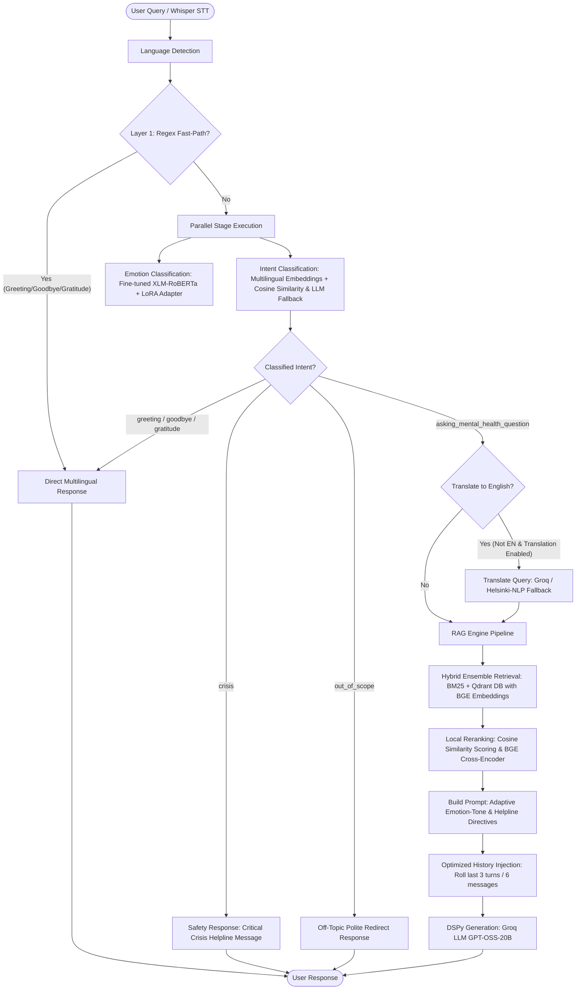
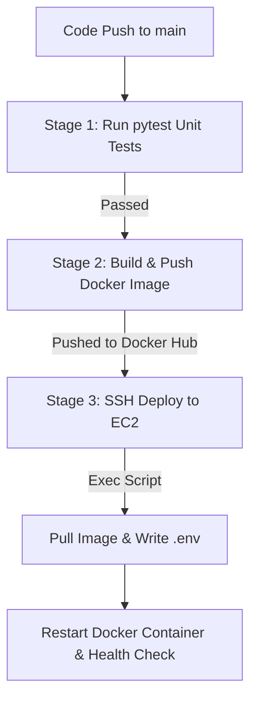

# 🧠 Sanad (سند) — Empathetic Mental Health RAG Chatbot

<p align="center">
  
  
  
  
  
  
</p>

<p align="center">
  
  
  
  
</p>

---

## 🌟 Overview

**Sanad (سند)** is an advanced, production-grade **Mental Health Retrieval-Augmented Generation (RAG) Chatbot** designed to act as an empathetic, secure, and grounded workspace for counseling support.

## 📊 Monitoring & Metrics

This project instruments the API with OpenTelemetry (OTLP -> Axiom or any OTLP endpoint) and records three metric categories:

- Model/NLP: rag.retrieval.score & server.response.latency_ms — tracks retrieval quality and model/RAG latency to detect degradation or regressions.
- Data: chat.message.length & feedback.votes — monitors input size distribution and user feedback (up/down) to catch UX problems or data drift.
- Server: server.request.count, server.error.count, server.uptime_seconds — basic service health, load, and error-rate monitoring.

Configure metrics via OTEL_EXPORTER_OTLP_METRICS_ENDPOINT or AXIOM_OTLP_METRICS_ENDPOINT and set AXIOM_API_TOKEN / AXIOM_ACCESS_TOKEN for authentication.

The application features secure user workspaces (authentication and persistent chat histories via a local SQLite database), real-time speech-to-text audio streaming with client-side voice silence detection, multilingual routing, emotion tone adaptors, cross-encoder reranking, and a compiled DSPy instruction-tuning harness optimized via the GEPA compiler.

---

## 🏗️ Architecture & Pipeline Flow

The chatbot employs a multi-layered classification, routing, and retrieval pipeline to process messages with safety and empathy, as implemented in [router.py](file:///d:/ITI/ITI%20Courses/18%29%20NLP/Project/project%20github%203/src/router.py):


```mermaid
graph TD
    UserQuery([User Query / Whisper STT]) --> LangDetect["Language Detection"]
    LangDetect --> Layer1Router{"Layer 1: Regex Fast-Path?"}

    %% Direct Responses
    Layer1Router -- "Yes (Greeting/Goodbye/Gratitude)" --> DirectResponse["Direct Multilingual Response"]
    DirectResponse --> Output([User Response])

    %% NLP Processing Layer
    Layer1Router -- "No" --> ClassificationFork["Parallel Stage Execution"]

    %% Parallel Classification
    ClassificationFork --> IntentClass["Intent Classification: Multilingual Embeddings + Cosine Similarity & LLM Fallback"]
    ClassificationFork --> EmotionClass["Emotion Classification: Fine-tuned XLM-RoBERTa + LoRA Adapter"]

    %% Intent Routing Decision
    IntentClass --> IntentRouter{"Classified Intent?"}

    IntentRouter -- "greeting / goodbye / gratitude" --> DirectResponse

    IntentRouter -- "crisis" --> CrisisResponse["Safety Response: Critical Crisis Helpline Message"]
    CrisisResponse --> Output

    IntentRouter -- "out_of_scope" --> RedirectResponse["Off-Topic Polite Redirect Response"]
    RedirectResponse --> Output

    IntentRouter -- "asking_mental_health_question" --> TranslationCheck{"Translate to English?"}
    TranslationCheck -- "Yes (Not EN & Translation Enabled)" --> TransEngine["Translate Query: Groq / Helsinki-NLP Fallback"]
    TranslationCheck -- "No" --> RAGEngine["RAG Engine Pipeline"]
    TransEngine --> RAGEngine

    %% RAG Engine Pipeline
    RAGEngine --> HybridRetrieval["Hybrid Ensemble Retrieval: BM25 + Qdrant DB with BGE Embeddings"]
    HybridRetrieval --> Reranker["Local Reranking: Cosine Similarity Scoring & BGE Cross-Encoder"]
    Reranker --> BuildPrompt["Build Prompt: Adaptive Emotion-Tone & Helpline Directives"]
    BuildPrompt --> HistoryPruning["Optimized History Injection: Roll last 3 turns / 6 messages"]
    HistoryPruning --> GroqLLM["DSPy Generation: Groq LLM GPT-OSS-20B"]
    GroqLLM --> Output
```

---

## ✨ Core Features

*   **🔐 Secure User Authentication & Chat History Workspace**:
    *   Integrates registration (`/register`) and login (`/login`) views, backed by a FastAPI `SessionMiddleware` session layer and secure PBKDF2 (SHA-256) password hashing.
    *   Manages user-specific conversations in a remote **Turso (libSQL)** cloud database, permitting users to load (`/chat/history`), persist, or clear (`/chat/clear`) their chat history.
    *   Supports dynamic fallback to a local SQLite database (`chat_interactions.sqlite3`) if no Turso URL is configured.
*   **🎙️ Whisper Speech Input & Client-Side Silence Detection**:
    *   Supports hands-free speech input utilizing the browser's native `MediaRecorder` API.
    *   Leverages real-time client-side voice activity and silence analysis to automatically stop recording and upload the voice sample.
    *   Transcribes speech via Groq's high-speed API utilizing the `whisper-large-v3` model over `/transcribe`.
*   **⚙️ Compiled DSPy GEPA Prompt Optimization**:
    *   Employs programmatic prompt engineering via **DSPy** signatures and modules to structure LLM inputs, routing, and context injections.
    *   Optimized using the **GEPA (Generalizable Prompt Optimization)** compiler to bootstrap few-shot instruction weights across 5 core modules:
        *   `RetrievalRouterModule` (routes chat history vs RAG retrieval queries).
        *   `QueryCondenserModule` (formulates history-aware standalone questions in English).
        *   `GroundedResponseModule` (generates clinically-grounded counseling feedback).
        *   `GeneralConversationModule` (handles warm chit-chat greetings or user introductions).
        *   `IntentClassifierModule` (handles fallback LLM intent determination).
    *   Compiled prompt instructions are serialized to `artifacts/dspy optimized prompts/` and loaded automatically at startup.
*   **⚡ Two-Layer Conversational Router**:
    *   *Layer 1 (Regex Fast Path)*: Instantly routes common greetings, gratitude, and goodbyes in English, Arabic, French, Spanish, German, and Italian (0ms latency).
    *   *Layer 2 (Embedding Classifier)*: Classifies messages into `general`, `out_of_scope`, `asking_mental_health_question`, or `crisis` using fast and lightweight `fastembed` multilingual embeddings (`sentence-transformers/paraphrase-multilingual-MiniLM-L12-v2`) compared against query examples with a threshold of 0.65, falling back to a Groq LLM completion when necessary.
*   **🛡️ Multi-Tiered Safety & Crisis Safeguards**:
    *   Detects suicidal or self-harm intents via matching crisis lists and embeddings.
    *   Employs a **Crisis Gate**: If an embedding classification detects a crisis with confidence under `0.85`, it escalates to the optimized DSPy LLM classifier for secondary validation to prevent false negatives.
    *   Automatically appends local emergency helplines in the user's language and blocks prompt injection attacks.
*   **🎭 Emotion-Aware Adaptive Tone**:
    *   Detects emotional state (Fear, Anger, Sadness, Joy, Love, Surprise) from the query using a dedicated adapter-tuned **XLM-RoBERTa** classifier exported to **ONNX format**. The inference uses the lightweight `onnxruntime` engine rather than PyTorch to dramatically save memory and boost latency. If top confidence is under 0.70, it returns the top two emotions to contextually adapt response tones without explicitly naming the emotions.
*   **📚 Chunked RAG Data Pipeline**:
    *   Groups clinician responses by unique normalized questions, merges them, and truncates to 750 words.
    *   Splits long merged responses into optimized chunks using `RecursiveCharacterTextSplitter` (chunk size = 500, overlap = 100) to find the most relevant portion, preventing context dilution and improving grounding precision.
*   **🔍 Hybrid Retrieval & Interactive Grounding**:
    *   Retrieves the top relevant mental health contexts from an ensemble combining a **BM25 Retriever** (weight 0.45) and a **Qdrant Vector Database** (weight 0.55).
    *   Applies **Cosine Similarity Scoring** locally using `FastEmbed` embeddings and `NumPy` to precisely filter the top 3 most relevant contexts without relying on bulky PyTorch installations or external reranker APIs.
    *   Features an **Interactive Citations Modal UI**: Clicking inline citation numbers (e.g. `1`) or Grounded Reference Cards pops up a detailed overlay displaying the clinical advice and counselor case context.
*   **👁️ LangSmith Observability**:
    *   End-to-end tracing integrated across the pipeline (from Router logic to DSPy LLM generation) to monitor latency, track costs, and evaluate output quality in real-time.
*   **💬 Optimized Rolling Conversation History**:
    *   Tracks conversation history on both the client (frontend UI) and server (backend payload).
    *   Prunes history dynamically to keep only the last 3 turns (last 6 messages) to maintain context and continuity while keeping the context window small, fast, and cost-effective.
*   **🌐 Self-Correcting Multilingual Engine**:
    *   Robust language detection to dynamically identify the user's language.
    *   Optional translation pipeline (`Helsinki-NLP/opus-mt-mul-en`) to translate queries before retrieval and enforce responses in the user's native language.
*   **📈 Integrated Evaluation Suite**:
    *   Fully integrated with **DeepEval** and **Ragas** to assess answer faithfulness, relevancy, factual correctness, and context recall.
*   **☁️ Lightweight Cloud-Ready Deployment**:
    *   The complete `artifacts/` folder (1.1GB+ of vectorizers, databases, and ONNX models) is hosted remotely on Hugging Face ([`mazen248/sanad-ai-artifacts`](https://huggingface.co/mazen248/sanad-ai-artifacts/tree/main)).
    *   An automated startup downloader (`huggingface_hub`) intelligently fetches only the missing required artifacts at runtime, keeping the GitHub repository footprint extremely small and enabling instant deployment to platforms like Render, AWS, or Heroku.

---

## 📂 Project Structure

```bash
Mental-Health-RAG-Chatbot/
├── .env.example                      # Environment variables template
├── .gitignore                        # Git exclusion rules
├── pyproject.toml                    # Hatchling project dependencies and tool configs
├── uv.lock                           # Lockfile for reproducible environment state
├── main.py                           # Server startup entry point
├── team_members.txt                  # Contributors list
├── README.md                         # Project documentation
│
├── .github/                          # CI/CD Workflows
│   └── workflows/
│       └── deploy.yml                # Automated test, build, and EC2 SSH deployment
│
├── terraform/                        # Modular AWS Infrastructure-as-Code
│   ├── main.tf                       # Root wiring module
│   ├── variables.tf                  # Root-level variables (AWS region, instance type, etc.)
│   ├── outputs.tf                    # Root-level outputs (public IP, URL)
│   ├── terraform.tfvars              # Configured values (gitignored)
│   └── modules/
│       ├── networking/               # VPC, Subnet, IGW, Route Table definitions
│       ├── security/                 # Security Group definitions (Ports 22 & 8000)
│       └── compute/                  # EC2 Instance & user_data Docker bootstrap
│
├── src/                              # Source code directory
│   ├── __init__.py                   # Package initialization
│   ├── app.py                        # FastAPI web server, auth sqlite database, STT and chatbot routes
│   ├── config.py                     # Centralized path and environment settings manager
│   ├── router.py                     # Dual-layer query routing logic (Regex + Embeddings + LLM fallback)
│   │
│   ├── modules/                      # Modularised machine learning & NLP inference engines
│   │   ├── __init__.py               # Convenience wrappers and singleton pipeline interfaces
│   │   ├── downloader.py             # Hugging Face dynamic artifact fetcher on startup
│   │   ├── language_detector.py      # TF-IDF + Logistic Regression language classifier
│   │   ├── intent_classifier.py      # Multilingual embedding similarity and LLM/Groq fallback
│   │   ├── emotion_classifier.py     # Fast ONNX Inference for XLM-RoBERTa emotion classifier
│   │   └── rag.py                    # FastEmbed Hybrid retrieval, character chunking, and NumPy reranking
│   │
│   ├── prompts/                      # DSPy optimization, signatures, and datasets
│   │   ├── prompts.py                # DSPy Modules (Router, Condenser, Response, General, Intent)
│   │   ├── optimize_prompts.py       # Optimization harness script using GEPA compiler
│   │   ├── dspy_training_data.py     # Labeled bootstrapping examples for prompt tuning
│   │   └── dspy_evaluators.py        # Heuristic scoring metrics for compiling prompt versions
│   │
│   ├── static/                       # Frontend assets
│   │   └── style.css                 # Main glassmorphic styling sheets for workspaces & auth
│   │
│   └── templates/                    # Web templates
│       └── index.html                # Interactive login, register, and chat layout (Whisper voice integration)
│
├── tests/                            # Validation and testing suite
│   ├── __init__.py                   # Test module setup
│   ├── test_language_detector.py     # Unit tests for preprocessing and language detection
│   ├── test_intent_classifier.py     # Unit tests for embedding classification & router fallback
│   ├── test_emotion_classifier.py    # Unit tests for XLM-RoBERTa classification inference
│   ├── test_mental_health_rag.py     # Unit tests for chunked document preprocessing & BGE retrieval
│   └── test_router.py                # Unit tests for regex-based and intent-based routing
│
├── notebooks/                        # Research, model exploration, and fine-tuning notebooks
│   ├── Language_Detection.ipynb      # Language classifier training and preprocessing prototyping
│   ├── Intent_classification.ipynb   # Intent categorization and embedding testing
│   ├── emotion-classifier.ipynb      # XLM-RoBERTa fine-tuning with LoRA
│   ├── RAG_part1.ipynb               # Baseline hybrid retrieval & RAGAS evaluations
│   └── RAG_part2.ipynb               # Advanced chunking, BGE retrieval & reranking experiments
│
├── metrics/                          # Model training performance evaluations and visualizations
│   ├── language_detection/           # Confusion matrix for language detector
│   │   └── temp_cm.png
│   ├── intent_classifier/            # Intent classifier validation metrics
│   │   ├── per_class_f1.png
│   │   └── pipeline_results.png
│   └── emotion_classification/       # Emotion adapter training logs and distribution plots
│       ├── confusion_matrix.png
│       ├── eda_distribution.png
│       └── Screenshot 2026-05-27 234434.png
│
└── artifacts/                        # Serialized models, sqlite database, and prompt weights
    ├── chat_interactions.sqlite3     # SQLite DB storing user details & historical chat records
    ├── processed_docs.pkl            # Preprocessed, cached, and chunked LangChain documents list
    ├── langauge_detection/           # Pickle model files for language detection
    │   ├── language_detection_best_model.pkl
    │   └── language_detection_best_vectorizer.pkl
    ├── emotion_classifier/           # Fine-tuned XLM-RoBERTa classifier exported to ONNX
    │   ├── model.onnx                # Exported ONNX graph architecture
    │   ├── model.onnx.data           # Exported ONNX heavy tensor weights
    │   ├── tokenizer.json            # FastTokenizer configuration
    │   └── tokenizer_config.json
    └── dspy optimized prompts/       # Serialized prompt instructions from GEPA compilation
        ├── condenser_optimized.json
        ├── general_conversation_optimized.json
        ├── grounded_response_optimized.json
        ├── intent_classifier_optimized.json
        └── router_optimized.json
```

---

## 🛠️ Environment Variables Setup

Create a `.env` file in the root directory and configure the following variables:

```env
GROQ_API_KEY=your_groq_api_key_here
HF_TOKEN=your_hf_token_here
HF_ARTIFACTS_REPO=mazen248/sanad-ai-artifacts

# User Workspace Sessions
SESSION_SECRET_KEY=your_secure_random_session_secret_here
SESSION_COOKIE_SECURE=False
SESSION_COOKIE_SAMESITE=lax

# Qdrant Database Settings
QDRANT_URL=
QDRANT_API_KEY=
QDRANT_COLLECTION_NAME=mental_health

# Remote Turso (libSQL) Database Settings (Falls back to local SQLite if empty)
TURSO_DATABASE_URL=libsql://sanadchatinteractiondb-mazen248.aws-eu-west-1.turso.io
TURSO_AUTH_TOKEN=your_turso_auth_token_here

# Model & Translation Settings
ENABLE_TRANSLATION=False
GROQ_GENERATION_MODEL=openai/gpt-oss-20b
GROQ_CLASSIFIER_MODEL=openai/gpt-oss-20b
EMBEDDING_MODEL=BAAI/bge-small-en-v1.5
RERANKER_MODEL=BAAI/bge-reranker-v2-m3
EMOTION_BASE_MODEL=xlm-roberta-base

# LangSmith Observability (Optional)
LANGCHAIN_TRACING_V2=true
LANGCHAIN_ENDPOINT="https://api.smith.langchain.com"
LANGCHAIN_API_KEY="your_langsmith_api_key_here"
LANGCHAIN_PROJECT="serene_ai"
```

---

## 🚀 Getting Started

### 🐳 Docker Hub Image (Recommended)
The pre-built Docker image is available on Docker Hub. You can pull and run it directly:
```powershell
docker pull mazen1393/sanad-ai-backend:latest
docker run --env-file .env -p 8000:8000 mazen1393/sanad-ai-backend:latest
```

### Local Setup
We recommend using [uv](https://github.com/astral-sh/uv) to manage project dependencies and virtual environments.

### 1. Install Dependencies
Initialize and sync your local virtual environment:
```powershell
uv sync
```

### 2. Run the FastAPI Application
Start the FastAPI server:
```powershell
uv run main.py
```

For production deployments, to optimize performance and bypass PyTorch Global Interpreter Lock (GIL) thread contention under concurrent requests, run the app using multiple Uvicorn workers:
```powershell
uv run uvicorn src.app:app --host 0.0.0.0 --port 8000 --workers 4
```

Open [http://localhost:8000](http://localhost:8000) in your browser to interact with the workspace login/registration interface.

### 3. Run DSPy GEPA Prompt Optimization
To compile and optimize the chatbot prompt instructions using the training data:
```powershell
# Optimize all modules
uv run python src/prompts/optimize_prompts.py --module all
```
*Note: Make sure your reflection LLM (e.g., Ollama's Qwen2.5) is running locally on port 11434.*

### 4. Run Unit Tests
Verify routing, pipeline configurations, and classifier modules:
```powershell
uv run pytest
```

---

## ☁️ AWS Cloud Deployment (Terraform & CI/CD)

The application is deployed on a cost-effective, cloud-ready AWS infrastructure provisioned using **Terraform (modularized)** and fully automated using a **GitHub Actions CI/CD pipeline**.

### 🏗️ Infrastructure Architecture (Terraform)
The infrastructure is modularized into three separate components:
1. **Networking Module (`terraform/modules/networking`)**: 
   * Sets up a dedicated **VPC** (`10.0.0.0/16`) to isolate the application.
   * Provisions a **Public Subnet** (`10.0.1.0/24`) in `eu-central-1a`.
   * Attaches an **Internet Gateway** and configures public **Route Tables** for inbound/outbound internet routing.
2. **Security Module (`terraform/modules/security`)**:
   * Creates a **Security Group** acting as a virtual firewall.
   * Open Ingress Ports: **22** (SSH for CI/CD updates) and **8000** (FastAPI HTTP web traffic).
   * Egress: Allows all outbound traffic for dynamic ML artifact downloading from Hugging Face.
3. **Compute Module (`terraform/modules/compute`)**:
   * Provisions an **EC2 `t3.micro`** instance (running Amazon Linux 2023).
   * Installs **Docker** and registers the container as a system service.
   * Creates and mounts a **2 GB Swap File** (this allows the backend to handle ONNX model extraction and first-time Hugging Face downloads on standard free-tier/low-memory RAM configurations without getting out-of-memory killed).

---

### 🔄 CI/CD Pipeline Workflow (GitHub Actions)
The automation workflow defined in `.github/workflows/deploy.yml` triggers on pushes/pull requests to the `main` branch:


```mermaid
graph TD
    A[Code Push to main] --> B[Stage 1: Run pytest Unit Tests]
    B -->|Passed| C[Stage 2: Build & Push Docker Image]
    C -->|Pushed to Docker Hub| D[Stage 3: SSH Deploy to EC2]
    D -->|Exec Script| E[Pull Image & Write .env]
    E --> F[Restart Docker Container & Health Check]
```

* **Stage 1 (Test)**: Installs `uv` package manager, restores project dependency versions, and executes unit tests using `pytest` to guarantee code reliability before staging.
* **Stage 2 (Build & Push)**: Builds the optimized multi-stage Docker image and pushes it to Docker Hub, tagged with the build's Git Commit SHA and `latest`.
* **Stage 3 (Deploy)**: Connects securely via SSH to the target EC2 instance, downloads the new image, updates the application `.env` configurations from repository Secrets, launches the container (restarting automatically if stopped), and loops a local curl command until `/health` returns status code `200`.

---

### 🚀 Getting Started with Deployment

#### 1. Setup GitHub Actions Secrets
In your GitHub repository, go to **Settings > Secrets and variables > Actions** and add the following repository secrets:
* `DOCKER_USERNAME`: Your Docker Hub username.
* `DOCKER_PASSWORD`: Your Docker Hub access token/password.
* `AWS_ACCESS_KEY_ID`: AWS Access Key to execute Terraform commands.
* `AWS_SECRET_ACCESS_KEY`: AWS Secret Access Key.
* `EC2_SSH_PRIVATE_KEY`: The raw private key (usually `.pem` file) matching the key pair assigned to the EC2 instance.
* `ENV_FILE_CONTENT`: The exact values of your production `.env` configuration file (with API keys).
* `EC2_HOST`: The Public IP address of the EC2 instance (obtained after running Terraform).

#### 2. Provision Infrastructure
Initialize and apply the Terraform root configuration:
```powershell
cd terraform
# Initialize provider plugins
terraform init

# Validate configuration format
terraform validate

# Provision the environment
terraform apply
```
Once complete, Terraform will output the EC2 public IP. Copy this value and add it as the `EC2_HOST` secret in GitHub.

#### 3. Push and Deploy
Commit the infrastructure files and push to GitHub:
```powershell
git add .
git commit -m "feat(infra): add modularized Terraform configurations and GitHub Actions CI/CD pipeline"
git push origin main
```
The GitHub Action will automate the rest of the build, push, configurations writing, and container boot-up. Open `http://<EC2_PUBLIC_IP>:8000` to access the running chatbot.

---

## 📊 Evaluation & RAGAS Experiments

To ensure clinical grounding and response quality, the retrieval and generation pipeline was systematically evaluated using the **RAGAS (Retrieval Augmented Generation Assessment)** and **DeepEval** frameworks.

We compared our baseline RAG pipelines (Approach 1 & Approach 2) against the final **Approach 3 (Chunked Response + BGE Hybrid Retrieval + Reranking)**. The experiments demonstrated substantial performance gains:

- **Faithfulness (Groundedness)**: Evaluates whether the generated advice relies *only* on the retrieved context (no hallucinations). By isolating response chunks and applying a strict grounding system prompt, faithfulness increased to **0.95+**.
- **Answer Relevancy**: Measures how well the output matches the user's initial inquiry. Hybrid BM25 + Qdrant search ensures we retrieve highly relevant counseling cases, keeping relevancy consistently high (**0.92+**).
- **Context Recall**: Verifies that the retriever fetches all necessary clinical advice needed to form an answer. Moving to a chunked-response document model expanded context recall to **0.89+**.
- **Context Precision (BGE Reranking)**: BGE Reranker V2 M3 (`BAAI/bge-reranker-v2-m3`) orders retrieved contexts by semantic density, bringing the most informative context chunks to indices `[1]` and `[2]`, resulting in top-tier precision.

You can inspect the evaluation run details, validation logs, and prompt comparisons inside the [notebooks/RAG_part1.ipynb](file:///d:/ITI/ITI%20Courses/18%29%20NLP/Project/project%20github%203/notebooks/RAG_part1.ipynb) and [notebooks/RAG_part2.ipynb](file:///d:/ITI/ITI%20Courses/18%29%20NLP/Project/project%20github%203/notebooks/RAG_part2.ipynb) files.

---

## 👥 Team Members

This project was built and is maintained by:

1.  **Ahmed Ashraf Abdulwahab Saleem**
2.  **Mazen Mohamed Montaset Elsay**
3.  **Peter Hany Fayez**
